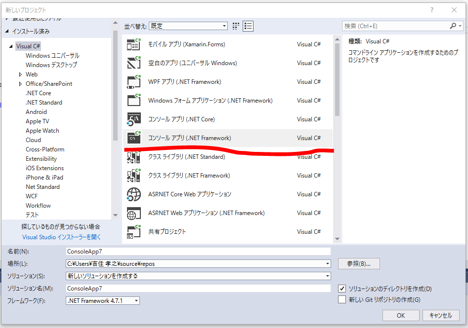
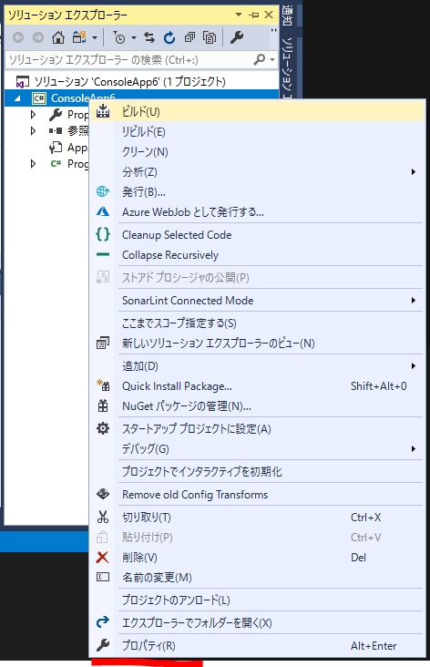
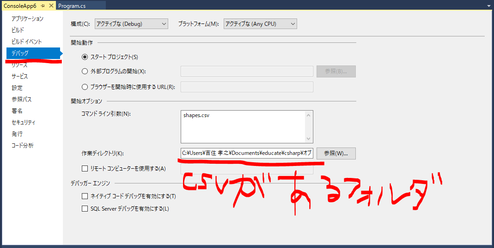

# 下準備
1. ソリューションはVisualC#のコンソールアプリ(.NETFramework)を選択する  

1. 以下はcsvを読み込むコードなので、初めのMain関数を丸々置き換えてください。
```
public class Program
{
    static void Main(string[] args)
    {
        var fileName = args[0];
        var lines = new List<string>();

        // Csvファイルの読み込み
        using (var sr = new StreamReader(fileName, Encoding.UTF8, false))
        {
            string line;
            while ((line = sr.ReadLine()) != null)
            {
                lines.Add(line);
            }
        }

        // Csvのファイル一行ずつの情報を格納
        // Csvのヘッダーを除くデータ部分は100行あるので、parsedArgsには100個のParsedArgsが入る
        var parsedArgs = new List<ParsedArgs>();
        foreach (var arg in lines.Skip(1))
        {
            parsedArgs.Add(new ParsedArgs(arg));
        }
    }
}

/// <summary>
/// 一行の情報をカンマで分解して格納
/// </summary>
public class ParsedArgs
{
    public ParsedArgs(string args)
    {
        var fragment = args.Split(',');
        this.TriangleBottom = fragment[0];
        this.TriangleHeight = fragment[1];
        this.SquareBottom = fragment[2];
        this.SquareHeight = fragment[3];
        this.CircleRadius = fragment[4];
    }

    /// <summary>
    /// 三角形の底辺
    /// </summary>
    public string TriangleBottom { get; set; }

    /// <summary>
    /// 三角形の高さ
    /// </summary>
    public string TriangleHeight { get; set; }

    /// <summary>
    /// 正方形の底辺
    /// </summary>
    public string SquareBottom { get; set; }

    /// <summary>
    /// 正方形の高さ
    /// </summary>
    public string SquareHeight { get; set; }

    /// <summary>
    /// 円の半径
    /// </summary>
    public string CircleRadius { get; set; }
}
```
3. 読み込むcsvは"shapes.csv"で以下のようにパスを指定する  
  

